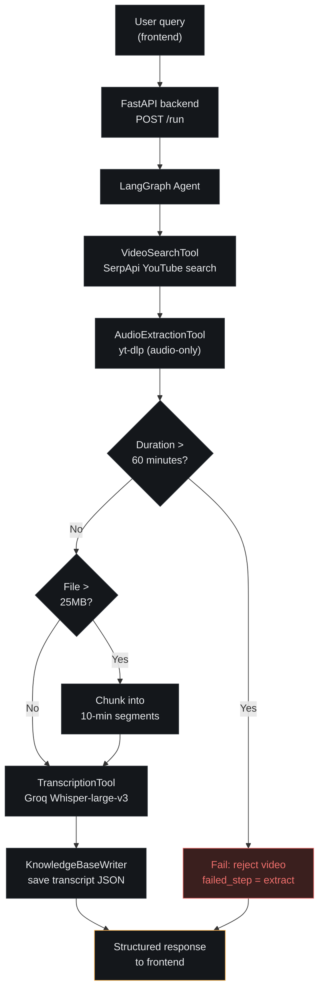

# 🎬 Video Agent — Video Search & Transcription Agent

An AI agent that takes a natural-language query, finds a matching YouTube
video, extracts and transcribes its audio, and saves the transcript to a
local knowledge base — orchestrated as a LangGraph pipeline and exposed
through a small web UI.

---

## Table of Contents

1. [Project Overview](#1-project-overview)
2. [System Flow / Architecture](#2-system-flow--architecture)
3. [Tech Stack](#3-tech-stack)
4. [Repository Structure](#4-repository-structure)
5. [Setup — Local Development](#5-setup--local-development)
6. [Running the Project Locally](#6-running-the-project-locally)
7. [Deployment](#7-deployment)
8. [API Reference](#8-api-reference)
9. [Known Limitations](#9-known-limitations)
10. [Troubleshooting](#10-troubleshooting)

---

## 1. Project Overview

Type a query like *"explain transformers in 5 minutes"* and the agent:

1. Searches YouTube for the best-matching video (**SerpApi**)
2. Pulls out just the audio track (**yt-dlp**)
3. Sends the audio to Groq's hosted **Whisper-large-v3** for transcription
4. Writes the transcript to a JSON file in `/knowledge_base`

Each step reports its own success or failure, so a bad search or an
oversized video fails loudly with a clear message instead of silently
breaking the chain. The whole thing is wrapped in a FastAPI backend and a
small static frontend so you can run it from a browser instead of the CLI.

---

## 2. System Flow / Architecture



GitHub renders this diagram natively — no image file needed, and it stays
in sync as long as you edit the diagram text alongside the code.

Each node in the LangGraph pipeline can fail independently. A failure
short-circuits the remaining nodes; the graph carries an `error` /
`failed_step` field through state instead of raising past the API
boundary — so the frontend always gets a structured response and can show
exactly which step failed and why.

**Step-by-step breakdown:**

| Step | Tool | What happens |
|---|---|---|
| 1. Search | `VideoSearchTool` | Calls SerpApi's YouTube engine with the user's query, returns the top matching video's URL, title, channel, and duration |
| 2. Extract | `AudioExtractionTool` | Downloads audio-only via yt-dlp, rejects videos over 60 minutes, saves to a temp directory |
| 3. Transcribe | `TranscriptionTool` | Sends the audio file to Groq's Whisper-large-v3 endpoint; chunks the file first if it exceeds Groq's 25MB limit |
| 4. Save | `KnowledgeBaseWriter` | Writes the transcript + video metadata to a timestamped JSON file in `/knowledge_base` |

---

## 3. Tech Stack

| Piece | Choice | Why |
|---|---|---|
| Agent orchestration | LangGraph | The pipeline is a fixed, dependent chain (each step needs the previous step's output) — an explicit state graph is easier to log and reason about than a ReAct tool-loop, while still reporting per-step progress |
| Video search | SerpApi (YouTube engine) | Free tier (100 searches/month), returns clean structured metadata without scraping YouTube directly |
| Audio extraction | yt-dlp | The standard, actively-maintained tool for pulling audio-only streams from YouTube |
| Transcription | Groq API, whisper-large-v3 | Fast, generous free tier (2,000 requests/day), OpenAI-compatible |
| Backend | FastAPI | Thin, typed HTTP wrapper around the agent; async-friendly if the pipeline grows |
| Frontend | Plain HTML/CSS/JS | Single page, a handful of UI states (query, steps, transcript, error) — no build step needed |
| Backend deployment | SnapDeploy (Docker) | Free tier: 10 deploys/day, up to 4 containers, 512MB RAM / 0.25 vCPU per container, auto-sleep/auto-wake, no credit card required per their stated free-tier terms |
| Frontend deployment | Vercel | Free tier, zero-config static hosting, instant redeploys on push |

---

## 4. Repository Structure

```
video-agent/
├── Dockerfile                   # builds the backend container for SnapDeploy
├── agent.py                     # LangGraph pipeline definition
├── api.py                       # FastAPI app (POST /run, GET /health)
├── config.py                    # env vars, constants, size/duration caps
├── requirements.txt
├── .env.example
├── .gitignore
├── tools/
│   ├── video_search_tool.py
│   ├── audio_extraction_tool.py
│   ├── transcription_tool.py
│   └── knowledge_base_writer.py
├── knowledge_base/              # transcripts land here (gitignored contents)
├── frontend/
│   ├── index.html
│   ├── app.js
│   ├── favicon.svg              # site icon
│   ├── favicon.ico              # fallback icon for browsers that don't support SVG favicons
│   ├── apple-touch-icon.png     # iOS/Safari home-screen icon
│   └── config.example.js
└── README.md
```

---

## 5. Setup — Local Development

**Prerequisites:**
- Conda
- Python 3.11+
- `ffmpeg` on your PATH (required by both yt-dlp and pydub)
  - Windows: `choco install ffmpeg`, or download from ffmpeg.org and add it to PATH
  - macOS: `brew install ffmpeg`
  - Linux: `sudo apt install ffmpeg`

**Clone and set up the environment:**

```bash
git clone https://github.com/m-sameerkhan/Video-Search-Transcription-Agent.git
cd Video-Search-Transcription-Agent

conda create -n video-agent python=3.11 -y
conda activate video-agent

pip install -r requirements.txt
```

**Configure API keys:**

```bash
cp .env.example .env
# then edit .env and fill in SERPAPI_KEY and GROQ_API_KEY
```

**Getting the API keys (both free, no credit card required):**
- **SerpApi** — sign up at https://serpapi.com/users/sign_up → your dashboard
  shows the key → 100 free searches/month.
- **Groq** — sign up at https://console.groq.com → API Keys → Create Key →
  2,000 free transcription requests/day.

---

## 6. Running the Project Locally

**Backend:**

```bash
uvicorn api:app --reload --port 8000
```

**Frontend** (static, no build step):

```bash
cd frontend
cp config.example.js config.js
# edit config.js only if your backend isn't on localhost:8000
python -m http.server 5173
# open http://localhost:5173 in your browser
```

Type a query, hit Run, and watch the four pipeline steps light up as they
complete.

---

## 7. Deployment

### Backend → SnapDeploy

1. Push this repo to GitHub if it isn't already there — SnapDeploy deploys
   from a connected git repo.
2. Go to https://snapdeploy.dev/register and sign up. Per SnapDeploy's
   stated free-tier terms, no credit card is required for the free plan
   (10 deploys/day, up to 4 containers). Confirm this holds true for your
   account as you go through signup — if a card prompt appears at any
   point, it contradicts their stated terms and is worth double-checking
   before proceeding.
3. Create a new deployment/service and connect this GitHub repo
   (`m-sameerkhan/Video-Search-Transcription-Agent`), branch `main`.
4. SnapDeploy should auto-detect the `Dockerfile` at the repo root and
   build from it directly.
5. **Port:** SnapDeploy auto-detects the port from this Dockerfile's
   `EXPOSE 8080` line. If it asks you to confirm a port manually, use
   **8080** to match the `CMD`.
6. **Environment variables:** add these as runtime variables:
   - `SERPAPI_KEY`
   - `GROQ_API_KEY`
   - `ALLOWED_ORIGINS` — leave a placeholder like `http://localhost:5173`
     for now; update it once your Vercel URL is live (see below).

   Never commit `.env` — secrets live only in SnapDeploy's environment
   variable settings.
7. Deploy. SnapDeploy assigns a public URL on a `*.snapdeploy.app`
   subdomain by default (custom domains are a paid "Always-On" feature).
8. **Free-tier behavior:** the free tier auto-sleeps when idle and
   auto-wakes in roughly 10-30 seconds on the next request — similar
   cold-start tradeoff to Render's free tier. You're also limited to
   10 deploys per day, which is generous for iterating on a small project
   but worth knowing if you're pushing frequently.

### Frontend → Vercel

1. Push the `frontend/` folder to GitHub (as part of this repo, or its own repo).
2. Go to https://vercel.com/new and import the project.
   - **Framework preset:** Other (it's static HTML/CSS/JS, no build step)
   - **Root directory:** `frontend/` (if the repo root contains other files)
3. Before or after the first deploy, edit `frontend/config.js` (copied from
   `config.example.js`) to point at your live SnapDeploy URL, e.g.:
   ```js
   window.API_BASE_URL = "https://<your-service>.snapdeploy.app";
   ```
4. Push the change — Vercel redeploys automatically on every push to the
   connected branch. Your frontend will be live at
   `https://<your-project>.vercel.app`.
5. Go back to SnapDeploy's environment variables (step 6 above) and set
   `ALLOWED_ORIGINS` to this Vercel URL, so CORS allows the frontend to
   call the backend.

### Site icon

The frontend ships with `frontend/favicon.svg` — a small play-button mark
in the same accent color as the UI. It's already wired into
`index.html` via a `<link rel="icon">` tag and shown next to the title in
the header. `favicon.ico` and `apple-touch-icon.png` cover browsers and
devices (older browsers, iOS home-screen bookmarks) that don't render an
SVG favicon directly. To use a different icon, swap out all three files
and keep the same filenames, or update the `href`/`src` references in
`index.html` if you rename them.

---

## 8. API Reference

### `POST /run`

Request:
```json
{ "query": "explain transformers in 5 minutes" }
```

Success response:
```json
{
  "success": true,
  "video_meta": {
    "video_url": "https://youtube.com/watch?v=...",
    "title": "Transformers Explained in 5 Minutes",
    "channel": "Some Channel",
    "duration": "5:12",
    "duration_seconds": 312
  },
  "transcript_path": "/app/knowledge_base/transformers-explained-1737400000.json",
  "transcript_preview": "In this video we'll break down...",
  "steps_log": [
    {"tool": "VideoSearchTool", "input": "explain transformers in 5 minutes", "output": "Transformers Explained in 5 Minutes"},
    {"tool": "AudioExtractionTool", "input": "https://youtube.com/watch?v=...", "output": "/app/temp_audio/ab12cd34.mp3"},
    {"tool": "TranscriptionTool", "input": "/app/temp_audio/ab12cd34.mp3", "output": "In this video we'll break down..."},
    {"tool": "KnowledgeBaseWriter", "input": "Transformers Explained in 5 Minutes", "output": "transformers-explained-1737400000.json"}
  ],
  "error": null,
  "failed_step": null
}
```

Failure response (e.g. video too long):
```json
{
  "success": false,
  "steps_log": [
    {"tool": "VideoSearchTool", "input": "...", "output": "Some Long Documentary"},
    {"tool": "AudioExtractionTool", "input": "...", "output": "FAILED: Video is 94 minutes long, which exceeds the 60-minute cap. Choose a shorter video."}
  ],
  "error": "Video is 94 minutes long, which exceeds the 60-minute cap. Choose a shorter video.",
  "failed_step": "extract"
}
```

### `GET /health`
```json
{ "status": "ok" }
```

---

## 9. Known Limitations

- **Ephemeral storage.** SnapDeploy's filesystem doesn't persist across
  auto-sleep/auto-wake cycles or redeploys on the free tier — anything in
  `/knowledge_base` or `/temp_audio` is lost. Fine for a demo; SnapDeploy's
  free tier has no free database add-on either, so anything durable would
  need an external store.
- **10 deploys/day cap.** Generous for normal iteration, but worth pacing
  if you're pushing many small commits in a short window.
- **Auto-sleep on the free tier.** Free containers sleep when idle and
  wake in roughly 10-30 seconds on the next request — same tradeoff as
  Render's cold starts. Always-on (no sleep) is a paid feature.
- **No custom domain on the free tier.** You get a `*.snapdeploy.app`
  subdomain; custom domains require the paid Always-On tier.
- **60-minute video cap.** Enforced before download, mainly to keep the
  container's disk usage bounded. A 60-minute video will often exceed
  Groq's free-tier 25MB upload limit on its own — chunking (below) is what
  actually keeps transcription working at this length, not the cap itself.
- **Chunking is best-effort.** Audio over 25MB is split into 10-minute mp3
  chunks and transcribed sequentially; at the 60-minute cap, most videos
  will now need chunking rather than the exception — expect more requests
  per video against Groq's daily quota, and slower end-to-end runs.
- **Free-tier rate limits.** SerpApi: 100 searches/month. Groq: 2,000
  transcription requests/day, 25MB/request. This agent does not queue or
  retry across these limits — a request that hits them fails with
  whatever error the provider returns.
- **No persistence, no auth.** By design for this version — see the
  original project brief for what's explicitly out of scope.

---

## 10. Troubleshooting

| Symptom | Likely cause | Fix |
|---|---|---|
| `ffmpeg not found` error | ffmpeg isn't on PATH | Install ffmpeg and restart your terminal/shell |
| CORS error in browser console | `ALLOWED_ORIGINS` doesn't include your frontend's URL | Add the exact frontend origin (including `https://`, no trailing slash) to the backend's `ALLOWED_ORIGINS` |
| SnapDeploy build doesn't use the Dockerfile | Build method not set to Dockerfile | Explicitly select Dockerfile as the build method in the service settings, if given the option |
| Service unreachable after deploy, or slow first response | Free-tier container was auto-asleep | Expected — send a request and wait 10-30 seconds for it to wake up |
| Hit the daily deploy cap | More than 10 deploys in a day on the free tier | Wait for the daily limit to reset, or batch your commits before pushing |
| Transcription fails on long videos | File exceeds Groq's per-request size limit | Confirm chunking is enabled in `config.py`, or lower `MAX_VIDEO_DURATION_SECONDS` |
| 403 / quota errors from SerpApi or Groq | Free-tier limit hit | Wait for the quota to reset, or upgrade the respective plan |

---