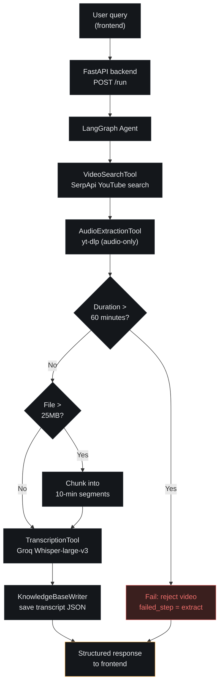

## Video Search & Transcription Agent
An AI agent that takes a natural-language query, finds a matching YouTube
video, extracts and transcribes its audio, and saves the transcript to a
local knowledge base — orchestrated as a LangGraph pipeline and exposed
through a small web UI, made publicly reachable via **Cloudflare Tunnel**.

---

## Table of Contents

1. [Project Overview](#1-project-overview)
2. [System Flow / Architecture](#2-system-flow--architecture)
3. [Tech Stack](#3-tech-stack)
4. [Repository Structure](#4-repository-structure)
5. [Setup — Local Development](#5-setup--local-development)
6. [Running the Project Locally](#6-running-the-project-locally)
7. [Deployment — Cloudflare Tunnel + Vercel](#7-deployment--cloudflare-tunnel--vercel)
8. [API Reference](#8-api-reference)
9. [Known Limitations](#9-known-limitations)
10. [Troubleshooting](#10-troubleshooting)

---

## 1. Project Overview

Type a query like *"explain transformers in 5 minutes"* and the agent:

1. Searches YouTube for the best-matching video (**SerpApi**)
2. Pulls out just the audio track (**yt-dlp**)
3. Sends the audio to Groq's hosted **Whisper-large-v3** for transcription
4. Writes the transcript to a JSON file in `/knowledge_base`

Each step reports its own success or failure, so a bad search or an
oversized video fails loudly with a clear message instead of silently
breaking the chain. The whole thing is wrapped in a FastAPI backend and a
small static frontend so you can run it from a browser instead of the CLI.

---

## 2. System Flow / Architecture




Each node in the LangGraph pipeline can fail independently. A failure
short-circuits the remaining nodes; the graph carries an `error` /
`failed_step` field through state instead of raising past the API
boundary — so the frontend always gets a structured response and can show
exactly which step failed and why.

**Step-by-step breakdown:**

| Step | Tool | What happens |
|---|---|---|
| 1. Search | `VideoSearchTool` | Calls SerpApi's YouTube engine with the user's query, returns the top matching video's URL, title, channel, and duration |
| 2. Extract | `AudioExtractionTool` | Downloads audio-only via yt-dlp, rejects videos over 60 minutes, saves to a temp directory |
| 3. Transcribe | `TranscriptionTool` | Sends the audio file to Groq's Whisper-large-v3 endpoint; chunks the file first if it exceeds Groq's 25MB limit |
| 4. Save | `KnowledgeBaseWriter` | Writes the transcript + video metadata to a timestamped JSON file in `/knowledge_base` |

**Live deployment's actual request path:**

```
Browser → Vercel (static frontend) → Cloudflare Tunnel (public edge)
        → your machine's localhost:8000 (FastAPI + the pipeline above)
```

The backend never leaves your own machine. Cloudflare Tunnel just gives it
a public HTTPS address without opening any router ports.

---

## 3. Tech Stack

| Piece | Choice | Why |
|---|---|---|
| Agent orchestration | LangGraph | The pipeline is a fixed, dependent chain (each step needs the previous step's output) — an explicit state graph is easier to log and reason about than a ReAct tool-loop, while still reporting per-step progress |
| Video search | SerpApi (YouTube engine) | Free tier (100 searches/month), returns clean structured metadata without scraping YouTube directly |
| Audio extraction | yt-dlp | The standard, actively-maintained tool for pulling audio-only streams from YouTube |
| Transcription | Groq API, whisper-large-v3 | Fast, generous free tier (2,000 requests/day), OpenAI-compatible |
| Backend | FastAPI | Thin, typed HTTP wrapper around the agent; async-friendly if the pipeline grows |
| Frontend | Plain HTML/CSS/JS | Single page, a handful of UI states (query, steps, transcript, error) — no build step needed |
| Backend exposure | **Cloudflare Tunnel** (`cloudflared`) | See [Section 7](#why-cloudflare-tunnel) for the full reasoning |
| Frontend deployment | Vercel | Free tier, zero-config static hosting, instant redeploys on push |

---

## 4. Repository Structure

```
video-agent/
├── agent.py                     # LangGraph pipeline definition
├── api.py                       # FastAPI app (POST /run, GET /health)
├── config.py                    # env vars, constants, size/duration caps
├── requirements.txt
├── .env.example
├── .gitignore
├── tools/
│   ├── video_search_tool.py
│   ├── audio_extraction_tool.py
│   ├── transcription_tool.py
│   └── knowledge_base_writer.py
├── knowledge_base/              # transcripts land here (gitignored contents)
├── frontend/
│   ├── index.html
│   ├── app.js
│   ├── favicon.svg              # site icon
│   ├── favicon.ico              # fallback icon for browsers that don't support SVG favicons
│   ├── apple-touch-icon.png     # iOS/Safari home-screen icon
│   ├── config.js                # committed — holds the backend URL, not a secret
│   └── config.example.js
└── README.md
```

---

## 5. Setup — Local Development

**Prerequisites:**
- Conda
- Python 3.11+
- `ffmpeg` on your PATH (required by both yt-dlp and pydub)
  - Windows: `choco install ffmpeg`, or download from ffmpeg.org and add it to PATH
  - macOS: `brew install ffmpeg`
  - Linux: `sudo apt install ffmpeg`
- `cloudflared` (see [Section 7](#installing-cloudflared) for install steps
  per OS) — required to expose the backend publicly. Not needed if you're
  only running everything on `localhost`.

**Clone and set up the environment:**

```bash
git clone https://github.com/m-sameerkhan/Video-Search-Transcription-Agent.git
cd Video-Search-Transcription-Agent

conda create -n video-agent python=3.11 -y
conda activate video-agent

pip install -r requirements.txt
```

**Configure API keys:**

```bash
cp .env.example .env
# then edit .env and fill in SERPAPI_KEY and GROQ_API_KEY
```

**Getting the API keys (both free, no credit card required):**
- **SerpApi** — sign up at https://serpapi.com/users/sign_up → your dashboard
  shows the key → 100 free searches/month.
- **Groq** — sign up at https://console.groq.com → API Keys → Create Key →
  2,000 free transcription requests/day.

---

## 6. Running the Project Locally

**Backend:**

```bash
uvicorn api:app --reload --port 8000
```

**Frontend** (static, no build step):

```bash
cd frontend
cp config.example.js config.js
# edit config.js only if your backend isn't on localhost:8000
python -m http.server 5173
# open http://localhost:5173 in your browser
```

Type a query, hit Run, and watch the four pipeline steps light up as they
complete.

---

## 7. Deployment — Cloudflare Tunnel + Vercel

### Why Cloudflare Tunnel

This project's backend needs `ffmpeg`, `yt-dlp`, disk I/O for temp audio
files, and can run for several minutes on longer videos — a genuine small
server process, not something that fits inside a typical serverless
function's time/memory limits. Given that, three deployment paths were
considered for actually exposing it:

- **A hosted container platform** (Render, SnapDeploy, Fly.io, etc.) —
  works, but means signing up for another service, building/pushing a
  Docker image, and living with that platform's free-tier constraints
  (cold starts, deploy caps, ephemeral storage regardless).
- **Cloudflare Containers** — Cloudflare's own container product, but it
  requires the **$5/month Workers Paid plan** (no free tier for Containers
  specifically) and a whole extra layer of complexity: a separate
  JavaScript/TypeScript Worker using a `Container` class backed by a
  Durable Object, a `wrangler.jsonc` config, and `npx wrangler deploy`
  with Docker running locally to build and push the image. That's a
  disproportionate amount of new surface area for what this project needs.
- **Cloudflare Tunnel (`cloudflared`)** — genuinely free, no account
  needed for a "quick tunnel," no Docker build, no extra language or
  framework. It's a small daemon that opens an *outbound* connection from
  this machine to Cloudflare's edge network, and Cloudflare hands back a
  public HTTPS URL that forwards straight to `localhost:8000`. The
  backend code doesn't change at all — it has no idea it's being reached
  from the internet.

**The honest tradeoff:** Cloudflare Tunnel isn't hosting — it's exposing.
The machine running `uvicorn` and `cloudflared` has to stay on and both
processes have to keep running for the public URL to work at all. That's
a real limitation compared to an always-on hosted backend, but for a
project meant to be demoed and iterated on locally (rather than run
unattended 24/7), it was the better fit: zero cost, minutes of setup,
no new account or platform to learn.

### Installing `cloudflared`

| OS | Command |
|---|---|
| Windows | `winget install --id Cloudflare.cloudflared` |
| macOS | `brew install cloudflared` |
| Linux | See https://developers.cloudflare.com/cloudflare-one/networks/connectors/cloudflare-tunnel/downloads/ for your distro's package |

**Windows-specific note:** after installing, **fully close and reopen
every terminal window** (not just a new tab in an already-open one) before
running `cloudflared`, so it picks up the updated PATH. If
`cloudflared --version` still isn't recognized after a full restart of
your terminal app, see [Troubleshooting](#10-troubleshooting) — this is a
real, commonly-hit snag on Windows.

### Setup steps

1. **Start the backend**, in its own terminal:
   ```bash
   uvicorn api:app --reload --port 8000
   ```

2. **Start the tunnel**, in a separate terminal (plain shell is fine — this
   one doesn't need conda activated):
   ```bash
   cloudflared tunnel --url http://localhost:8000
   ```
   Within a few seconds it prints a public URL:
   ```
   https://<random-words>.trycloudflare.com
   ```

3. **Test it directly** — open
   `https://<random-words>.trycloudflare.com/health` in a browser (typing
   a URL directly bypasses CORS, so this is a clean test of whether the
   tunnel and backend are actually reachable). You should see
   `{"status":"ok"}`.

4. **Point the frontend at the tunnel** — edit `frontend/config.js`:
   ```js
   window.API_BASE_URL = "https://<random-words>.trycloudflare.com";
   ```

5. **Allow the frontend's origin in CORS** — edit `.env`:
   ```
   ALLOWED_ORIGINS=http://localhost:5173,https://<your-project>.vercel.app
   ```
   This is your **frontend's** URL, not the tunnel URL — CORS controls who
   is allowed to *call* the API, which has nothing to do with what
   address the API itself is reachable at.
   `uvicorn --reload` does **not** pick up `.env` changes automatically —
   stop it (Ctrl+C) and restart it after editing this file.

6. **Commit and push `config.js`** — it's intentionally tracked in this
   repo (not gitignored), since it holds a backend URL, not a secret:
   ```bash
   git add frontend/config.js
   git commit -m "Update backend URL"
   git push
   ```

7. **Deploy the frontend to Vercel:**
   - Go to https://vercel.com/new, import this repo
   - **Root Directory:** set explicitly to `frontend` — otherwise Vercel
     scans the repo root, finds `api.py`/`requirements.txt`, and
     auto-detects a wrong "FastAPI" Application Preset
   - **Framework Preset:** should auto-correct to `Other` once Root
     Directory is set correctly; double-check before deploying
   - Leave Build Command / Output Directory blank — there's no build step
   - Click **Deploy**

### Keeping the tunnel URL fresh

**Quick tunnels don't persist across restarts.** Every time you stop and
re-run `cloudflared tunnel --url ...`, you get a *new* random
`trycloudflare.com` subdomain — it is not the same URL as last time. So
after any restart:

1. Copy the new URL from the terminal
2. Update `frontend/config.js`
3. Commit and push — Vercel redeploys automatically within ~30 seconds

For a **permanent** URL instead of a fresh one every session, you'd need a
*named* tunnel: add a domain to your Cloudflare account, run a one-time
`cloudflared tunnel login`, and use a config file instead of `--url`. Not
covered here since it requires owning a domain, but the quick-tunnel setup
above is the free, no-domain-needed path used for this project.

---

## 8. API Reference

### `POST /run`

Request:
```json
{ "query": "explain transformers in 5 minutes" }
```

Success response:
```json
{
  "success": true,
  "video_meta": {
    "video_url": "https://www.youtube.com/watch?v=SZorAJ4I-sA",
    "title": "Transformers, explained: Understand the model behind GPT, BERT, and T5",
    "channel": "Google Cloud Tech",
    "duration": "9:11",
    "duration_seconds": 551
  },
  "transcript_preview": "The neat thing about working in machine learning is that every few years, somebody invents something crazy that makes you totally reconsider what's possible...",
  "steps_log": [
    {
      "tool": "VideoSearchTool",
      "output": "Video found successfully"
    },
    {
      "tool": "AudioExtractionTool",
      "output": "Audio extracted successfully"
    },
    {
      "tool": "TranscriptionTool",
      "output": "Transcript generated successfully"
    },
    {
      "tool": "KnowledgeBaseWriter",
      "output": "Transcript saved to knowledge base"
    }
  ],
  "error": null,
  "failed_step": null
}
```

Failure response (e.g. video too long):
```json
{
  "success": false,
  "video_meta": null,
  "transcript_path": null,
  "transcript_preview": null,
  "transcript_full": null,
  "steps_log": [
    {
      "tool": "VideoSearchTool",
      "input": "Complete RAG Crash Course With Langchain In 2 Hours",
      "output": "Complete RAG Crash Course With Langchain In 2 Hours"
    },
    {
      "tool": "AudioExtractionTool",
      "input": "https://www.youtube.com/watch?v=o126p1QN_RI",
      "output": "FAILED: Video is 128 minutes long, which exceeds the 60-minute cap. Choose a shorter video."
    }
  ],
  "error": "Video is 128 minutes long, which exceeds the 60-minute cap. Choose a shorter video.",
  "failed_step": "extract"
}
```

### `GET /health`
```json
{ "status": "ok" }
```

---

## 9. Known Limitations

- **Your machine has to stay on.** This is the core tradeoff of using
  Cloudflare Tunnel instead of a hosted backend: the live site only works
  while your computer, `uvicorn`, and `cloudflared` are all running
  simultaneously. Closing the tunnel terminal, sleeping, or restarting
  your machine takes the live demo down until you start both again.
- **Quick tunnel URLs are not permanent.** Every fresh
  `cloudflared tunnel --url ...` run generates a new random
  `trycloudflare.com` subdomain — it does not persist or auto-update
  `config.js` for you.
- **Ephemeral storage.** `/knowledge_base` and `/temp_audio` live on your
  local disk — fine for a demo, but there's no backup or sync; a disk
  wipe or reinstall loses everything in them.
- **60-minute video cap.** Enforced before download, mainly to keep disk
  usage and total pipeline time bounded. Most videos at this length will
  need chunking (below) rather than being an edge case.
- **Chunking is best-effort.** Audio over 25MB is split into 10-minute mp3
  chunks and transcribed sequentially; longer videos mean more requests
  against Groq's daily quota and slower end-to-end runs (a ~45-50 minute
  video took roughly 5 minutes end-to-end in testing).
- **Free-tier rate limits.** SerpApi: 250 searches/month. Groq: 2,000
  transcription requests/day, 25MB/request. This agent does not queue or
  retry across these limits — a request that hits them fails with
  whatever error the provider returns.
- **No persistence, no auth.** By design for this version — see the
  original project brief for what's explicitly out of scope.

---

## 10. Troubleshooting

| Symptom | Likely cause | Fix |
|---|---|---|
| `ffmpeg not found` error | ffmpeg isn't on PATH | Install ffmpeg and restart your terminal/shell |
| `cloudflared` not recognized after `winget install` | New terminal session hasn't picked up the updated PATH yet (a new tab in an already-open terminal app can still inherit the old PATH) | Fully close every terminal window and reopen from the Start menu. If it still fails, refresh the current session's PATH manually: `$env:Path = [System.Environment]::GetEnvironmentVariable("Path","Machine") + ";" + [System.Environment]::GetEnvironmentVariable("Path","User")` |
| `uvicorn`/other conda-env tools stop being recognized after the PATH-refresh fix above | That refresh rebuilds `$env:Path` from only Machine + User registry values, which drops the PATH entries `conda activate` had prepended for that session | Run `conda activate video-agent` again in that same terminal to restore them. Better long-term: use separate terminals — one with conda activated for `uvicorn`, one plain for `cloudflared` |
| `config.js` returns 404 on the deployed Vercel site | The file is still listed in `.gitignore`, so Git silently never tracked or pushed it, even though it exists locally | Remove the `frontend/config.js` line from `.gitignore`, then `git add .gitignore frontend/config.js`, commit, and push |
| Frontend error says "Could not reach the backend at `http://localhost:8000`" even on the live Vercel site | `window.API_BASE_URL` is undefined in the browser (falls back to the default) — usually because `config.js` 404'd or was never deployed | Visit `<your-site>/config.js` directly in the browser to confirm it's being served with the right content; if 404, see the row above |
| Frontend error says "Could not reach the backend" at the *correct* tunnel URL, but visiting `<tunnel-url>/health` directly in the browser works fine | This is a CORS problem, not a connectivity problem — direct URL visits bypass CORS, but `fetch()` calls from JS don't | Check the browser console (F12) for a message mentioning "CORS policy"; then confirm `.env`'s `ALLOWED_ORIGINS` includes your exact Vercel URL, and restart uvicorn (it doesn't reload `.env` automatically) |
| Vercel auto-detects "FastAPI" as the Application Preset | Root Directory wasn't set to `frontend` before Vercel scanned the repo, so it found `api.py`/`requirements.txt` at the root | Set Root Directory to `frontend` first — the preset should auto-correct to `Other` once you do |
| Live Vercel site loads but every query fails | The Cloudflare tunnel (or `uvicorn`) isn't running anymore, or the tunnel URL changed since the last deploy | Confirm both are running locally; if the tunnel URL changed, update `config.js`, commit, and push |
| Transcription fails on long videos | File exceeds Groq's per-request size limit | Confirm chunking is enabled in `config.py`, or lower `MAX_VIDEO_DURATION_SECONDS` |
| 403 / quota errors from SerpApi or Groq | Free-tier limit hit | Wait for the quota to reset, or upgrade the respective plan |

---